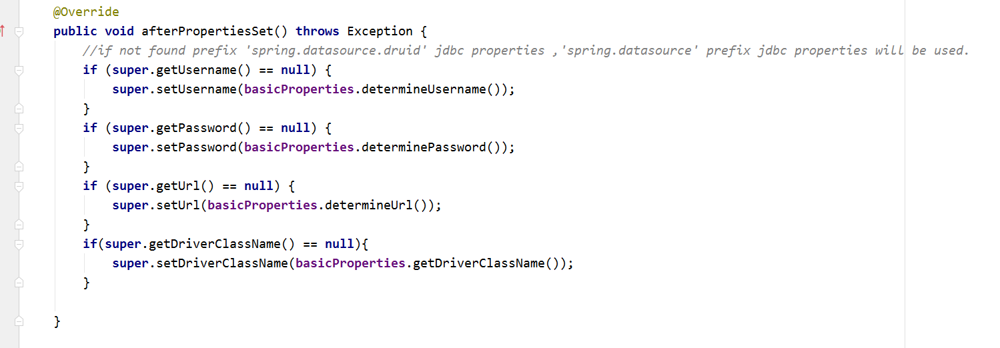

## 一、相关链接
1. [springboot多数据源配置](https://www.jianshu.com/p/dfd5ae340011)

## 二、装配过程
>       首先通过@EnableConfigurationProperties({DruidStatProperties.class, DataSourceProperties.class})装配DataSourceProperties,
>     其本身也初始化了DruidDataSourceWrapper这个类自动注入@ConfigurationProperties("spring.datasource.druid")下的属性,druid将结合
>     原生的DataSource和DruidDataSourceWrapper进行组装,关键方法afterPropertiesSet()将两者结合
    
+ 包装类
