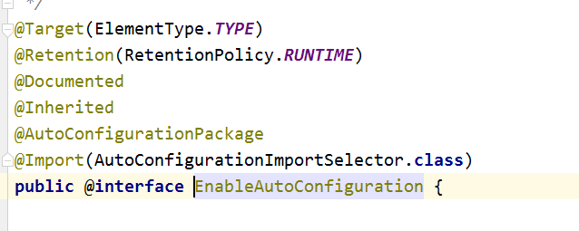
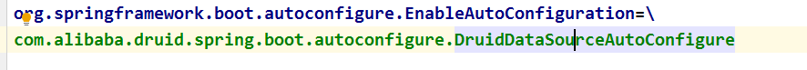
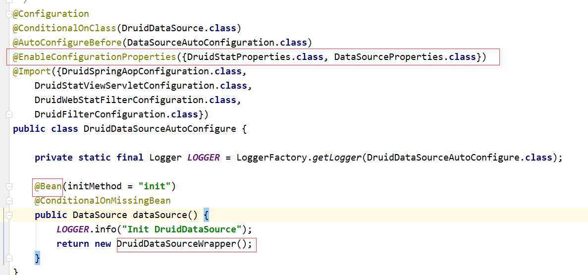
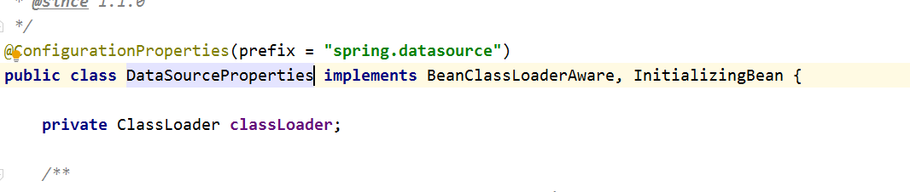

##一、**相关链接**
1. [springboot自动配置原理](https://blog.csdn.net/u014745069/article/details/83820511)

##二、自动配置代码解析
1. _@EnableAutoConfiguration_
>        EnableAutoConfiguration关键在于继承了Import,Import将自动加载各个boot-starter包下META-INF->spring.factorices文件中定义的类,
>     其中@EnableConfigurationProperties({DruidStatProperties.class, DataSourceProperties.class})用于将指定的类加载到spring容器中,
>     xxxProperties中的@ConfigurationProperties(prefix = "spring.datasource")在加入spring容器时将自动配置
   
   + 继承    
   
   + 导入              

   + 装配初始化

   + 属性装配

